# Semantic-HTML-Refactor

Semantic HTML refactor for marketing agency website

[Deployed webpage](https://c-sim.github.io/semantic-html-refactor/)

Refactor of HTML and CSS codebase to follow accessibility standards so that the site is optimised for search engines.

Accessibility improved by:

- Adding descriptive page title
- Fixing broken links
- Adding alt attributes to images
- Adding title to background image
- Divs replaced with semantic HTML elements
- Footer given logical heading
- Classes specific to only one element changed to ids
- Duplicate 'benefit-' classes consolidated to 'benefits' class
- Duplicate section content classes consolidated to 'content' class
- Order of CSS script adjusted to match flow of HTML file and webpage

//Questions:

- OK to use id for semantic elements which could be duplicated to futureproof? e.g. main, section, aside
- OK to remove id for semantic elements which will only occur once? e.g. footer
- OK to name class and id the same name?

//To do:

- Add final screenshots to readme

Technologies:

- Semantic HTML
- CSS
- Git

Webpage _before_

Website _after_

HTML _before_
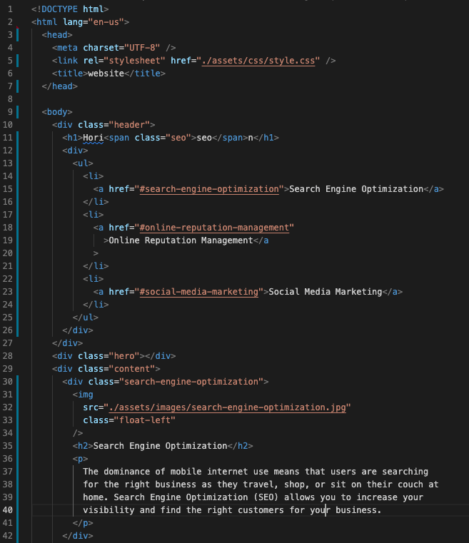
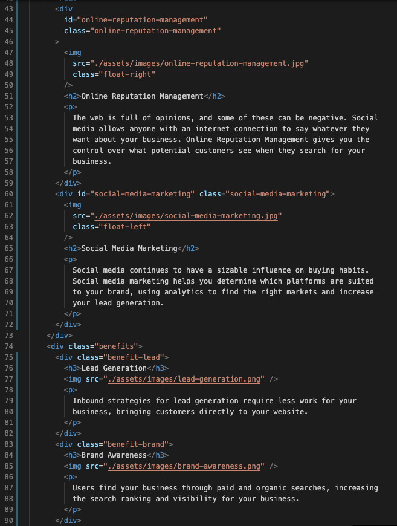
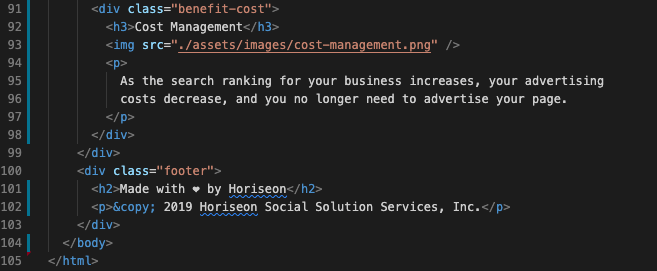
CSS _before_
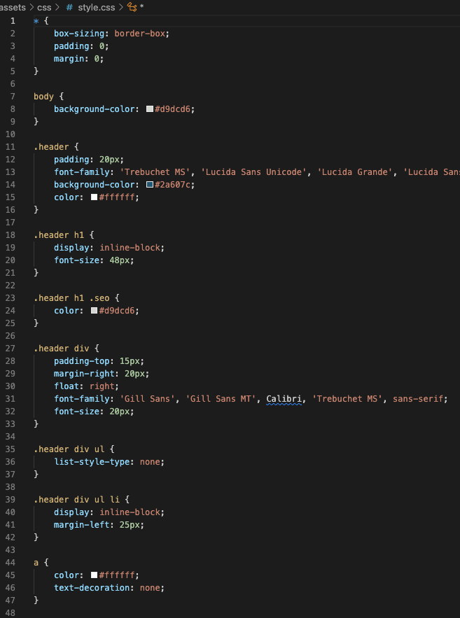
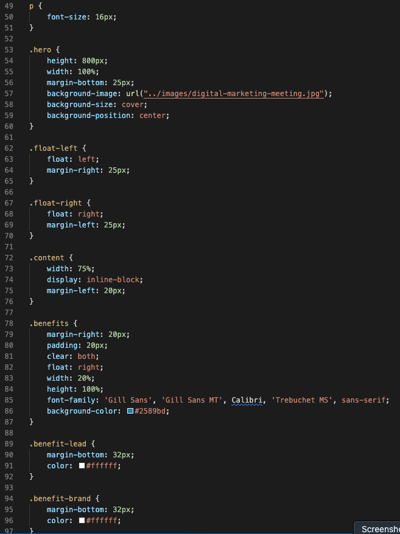
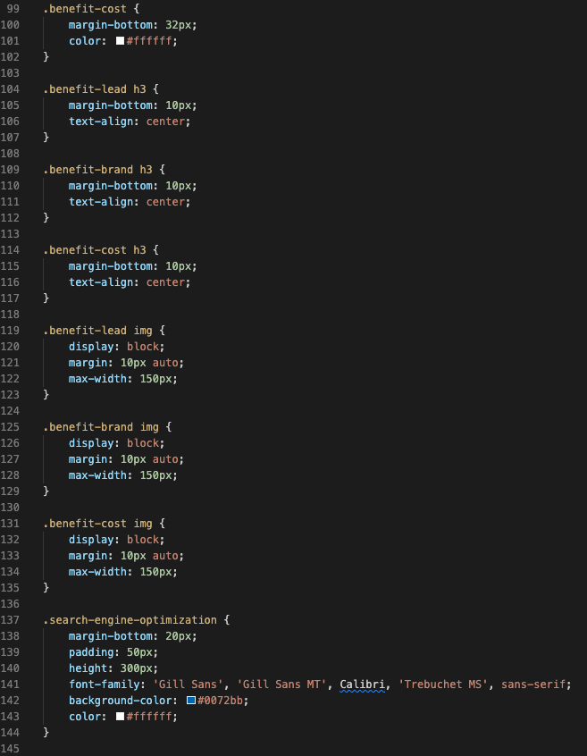
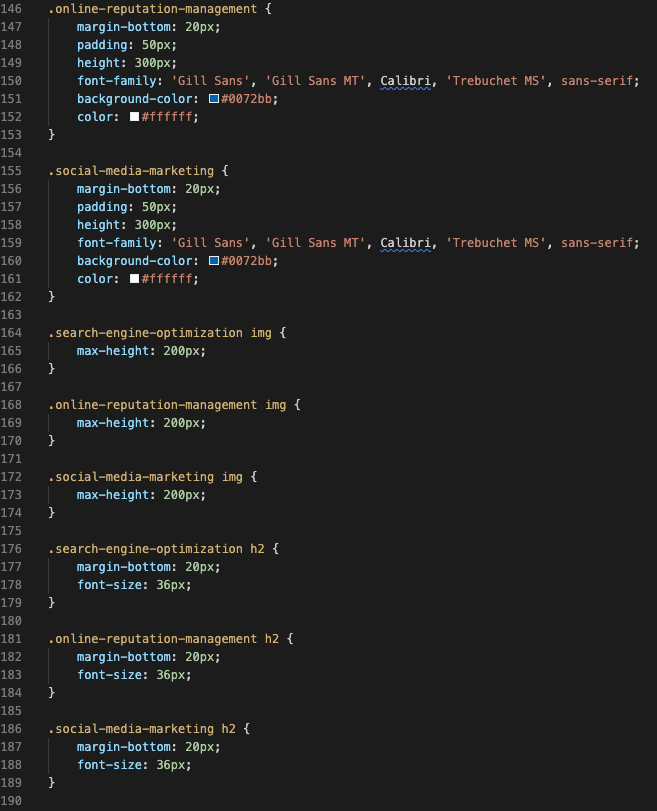
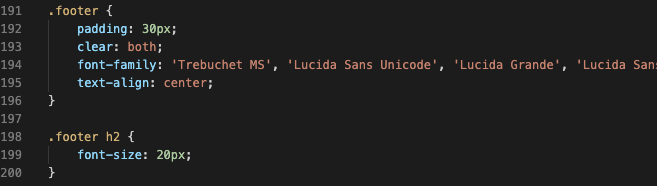

HTML _after_
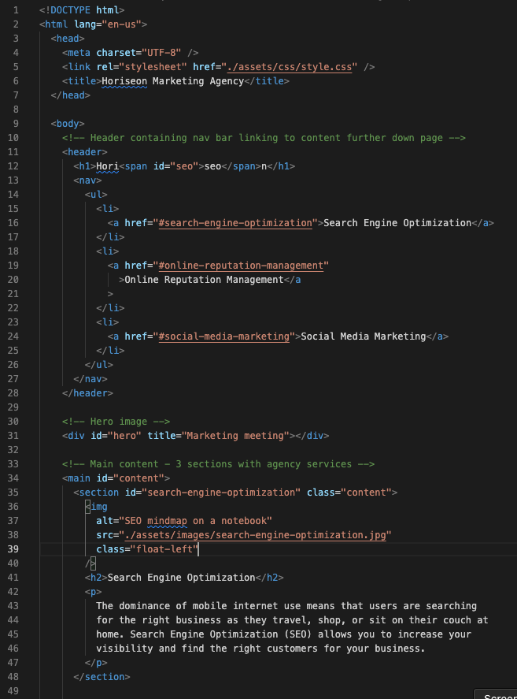
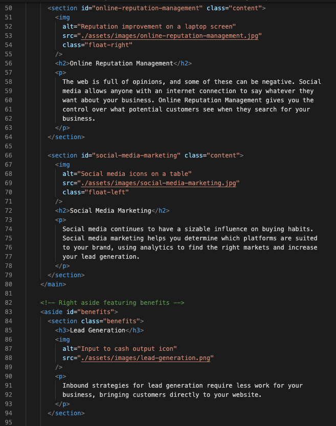
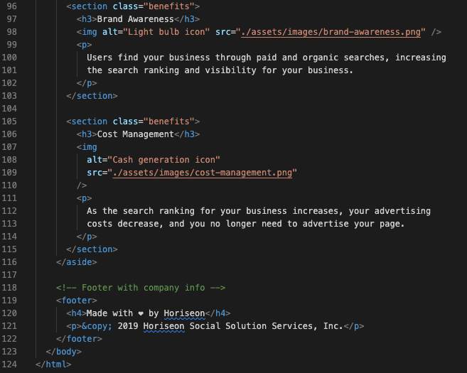

CSS _after_
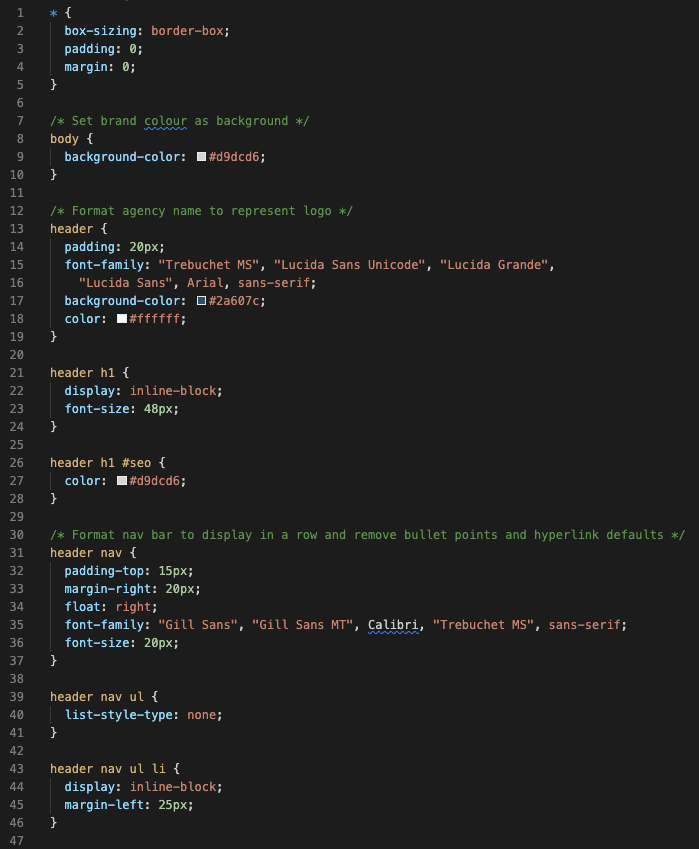
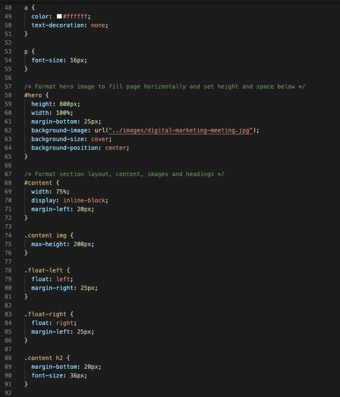

